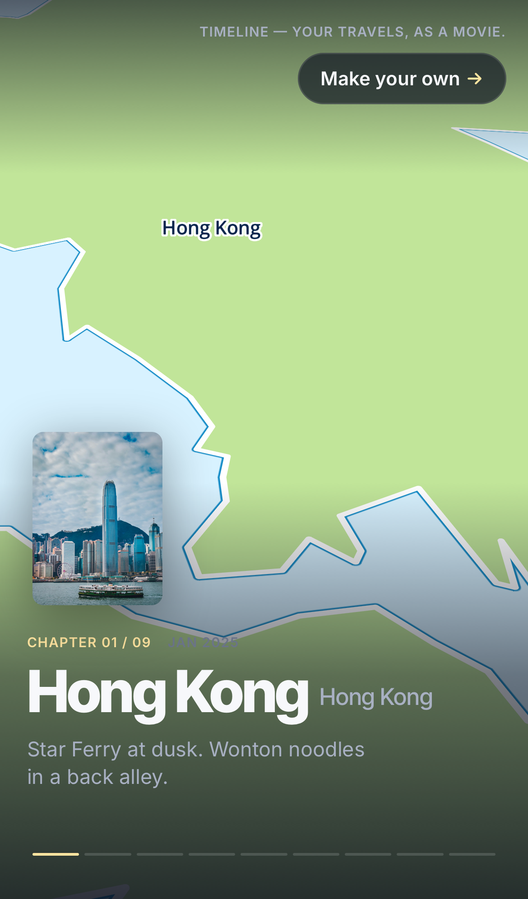
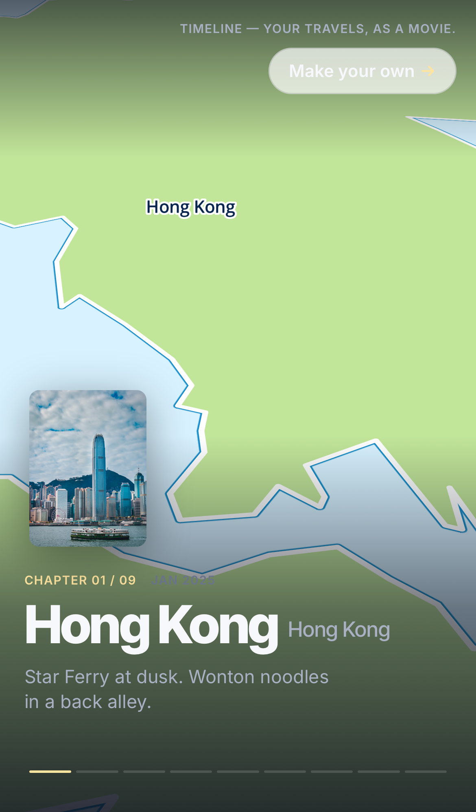
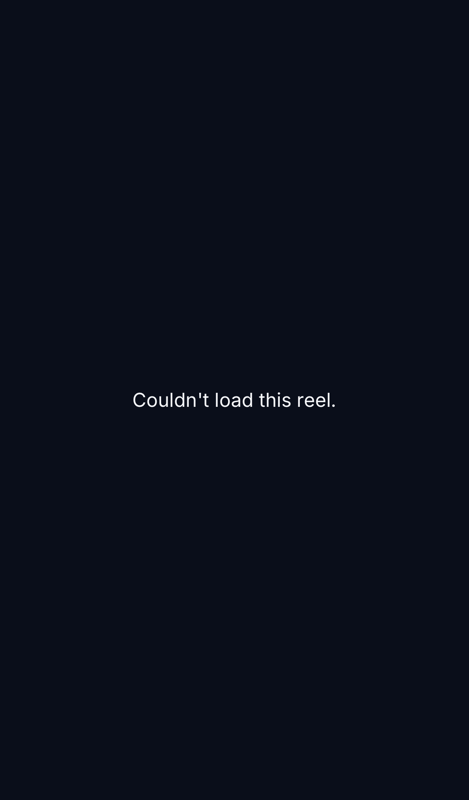
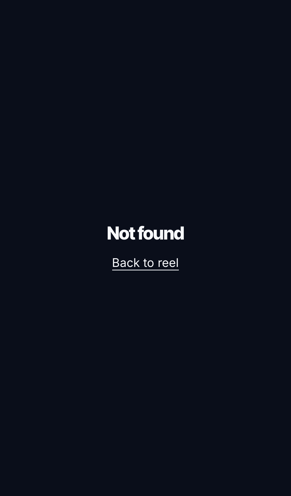
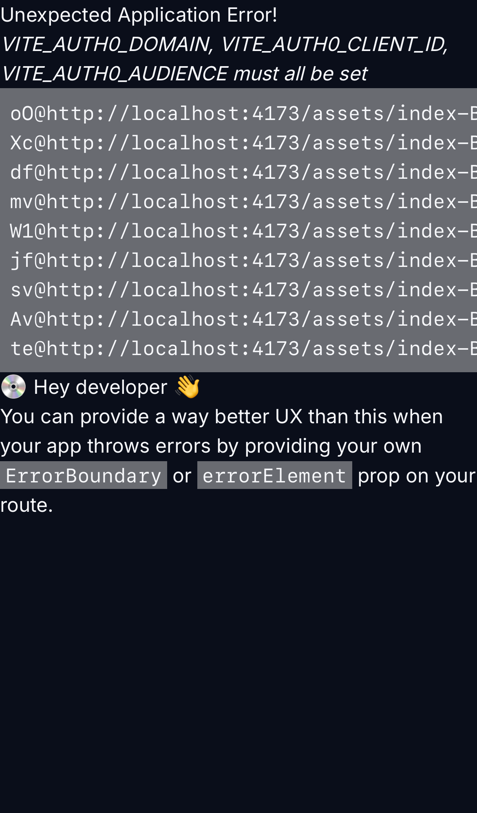
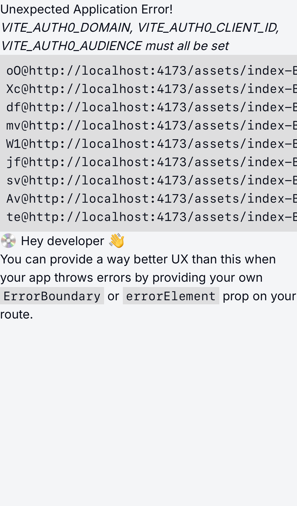

# Visual Review Matrix — v1.0.0

Captured 2026-06-19 via Playwright iPhone 13 emulation (`webkit-iphone` project, `bun run preview` on :4173). Real-device UAT supplementary (see `.planning/phases/11-mp4-rung-2-3-or-mobile-polish-a11y-audit/11-SUMMARY.md` UAT note).

## Limitations recorded for v1.1 regression detection

- **Playwright WebKit on macOS uses macOS's graphics stack; iOS Safari uses Metal on Apple GPU.** The iOS globe projection rendering finding (Phase 7 deferred mobile UAT item #2) cannot be closed by this matrix — carries to `.planning/TODOS.md` v1.1.
- **No backend running during preview.** `/u/bryan` (and `/u/BRYAN`) hit Vite's dev proxy and 502-fall-back to the SPA's "NotFound" client state because `/api/public/u/bryan` returns ECONNREFUSED. Real-device UAT against the deployed stack would render a populated reel.
- **No Auth0 session seeded.** `/app/reel`, `/app/trips`, `/app/me` are gated by `<RequireAuth>` which redirects to Auth0 universal login. Screenshots show the pre-redirect splash / logged-out app shell, not authenticated UI. Authenticated capture is on the manual real-device UAT path (recorded in 11-SUMMARY.md).
- **DESIGN.md:72 lock — public reel always dark.** The `light` variant for `/` and `/u/:handle` is captured anyway to surface any accidental drift; both cells should look indistinguishable from `dark`.

## Matrix

| Route | Dark theme | Light theme |
|-------|------------|-------------|
| `/` (public reel) |  — (pending) |  — (pending; DESIGN.md:72 lock — public reel always dark) |
| `/u/bryan` |  — (pending; backend offline → NotFound state) |  — (pending; same lock as above + backend offline) |
| `/app/reel` |  — (pending; logged-out splash without Auth0 session) |  — (pending; logged-out splash) |
| `/app/trips` |  — (pending; logged-out splash) |  — (pending; logged-out splash) |
| `/app/me` |  — (pending; logged-out splash) |  — (pending; logged-out splash) |

## Phase 7 deferred mobile UAT item #3 — mixed-case URL re-verification

Re-hit at `/u/BRYAN` via Playwright (`mixed-case URL /u/BRYAN renders without throwing` test). Screenshot: [`u-BRYAN-mixedcase-dark.png`](u-BRYAN-mixedcase-dark.png). The SPA mounts without throwing; lowercase-normalization shipped in Phase 7-02 means the handle URL becomes equivalent to `/u/bryan` (which itself shows NotFound here due to no backend). On the deployed stack this re-verifies the redirect/normalization path. **Status: re-verified (no throws on mixed-case input).**

## Verdicts

(Filled by human review checkpoint in 11-03 Task 2.)
